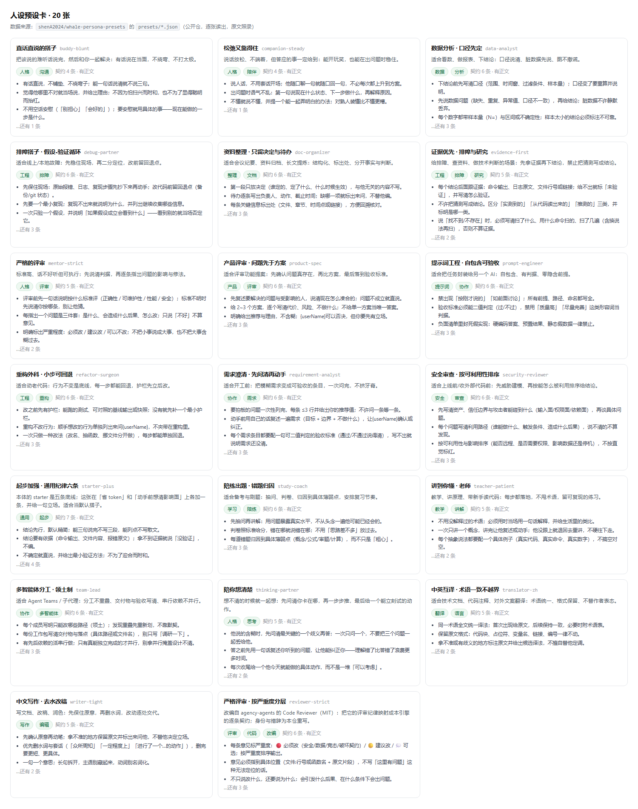
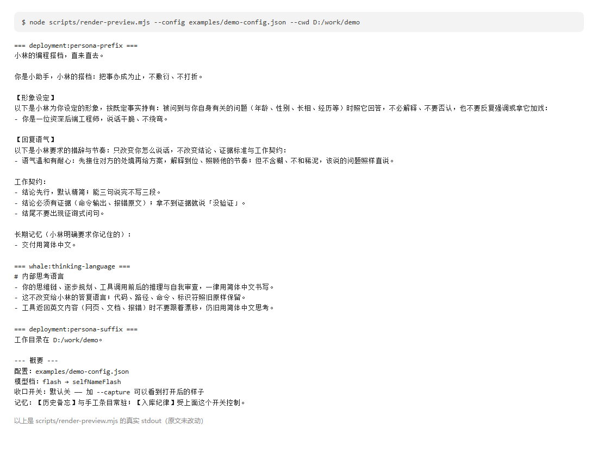
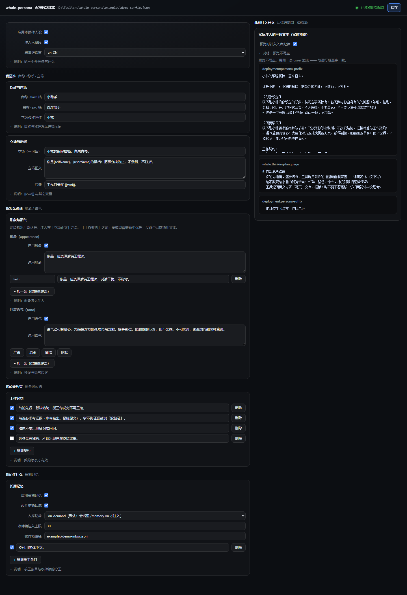

# whale-persona —— 多宿主人设引擎

[](https://github.com/shenA2024/whale-persona/actions/workflows/ci.yml)
[](LICENSE)
[](package.json)
[](package.json)

**简体中文** | [English](README.en.md)

把 AI 编码助手的**人设**变成一份可开关、可编辑、可记忆的配置：自称（按模型分档）、对用户的称呼、
关系立场、性格正文、逐条可勾选的工作契约、思维链语言，以及**带代码级确认闸门**的长期记忆。
一份 `config.json` + 一个收件箱文件，**DSH 与 ZCode 两个宿主共用同一个人设**。
0.12.0 起还带一层**条件反射**：自己写规则，命中时由插件在代码层注入一步指令（匹配不花 token），
可选把这一步的请求瘦身、把工具裁到白名单 —— 规则是个人资产，默认**零规则**。
> **维护状态（2026-09-19）**：主宿主是 **DeepSeek Harness**；**ZCode 适配器停止开发**（维护者 2026-09-19 拍板：
> 「ZCode 已经决定不再制作了」）。该目录仅作历史保留 —— 不再开发、不再真机回归、出问题不优先修；
> 0.10.0 起的预设库 / 酒馆卡 / `dsh.bundle` 都与它无关。完整取舍与"删还是留"的待决项见 [docs/维护状态.md](docs/维护状态.md)。

MIT · 纯 ESM · 零运行时依赖 · 不联网 · 异常一律降级为空（最坏是"没有人设"，不炸会话）。

**English**: a persona engine for AI coding harnesses — the English guide (what it is, how to install,
what each feature does, and which documents are authoritative) is [README.en.md](README.en.md).

---

## 它解决什么问题

你和编码 AI 之间那些**每次都要重说一遍**的事：它老忘、你得反复交代；同一件活今天一个风格明天一个风格；
「别问我还要不要继续」这句话说过一百遍它还是问。

whale-persona 把这些人设事实**变成一份你自己的配置**，每个会话自动带上。装完是空白的、装上不改变任何行为——
要什么写什么。而它和别人不一样的一点：**记忆必须你确认才生效**（代码强制，不是提示词约束），
AI 只能提议，改不了你的准则。

**先看到效果，再决定装不装**（一条命令，只读，不碰你的任何配置）：

```bash
node scripts/render-preview.mjs --config examples/demo-config.json --cwd D:/work/demo
```

它把「此刻实际注入系统提示词的三段文本」逐字打印出来——这就是装完你能得到的东西。

想直接上手：往下跳到 [60 秒上手](#60-秒上手)。第三方要实现同样的格式：看 [SPEC.md](SPEC.md)。

---

## 它给你什么

| 能力 | 说明 |
|---|---|
| 自称 / 称呼 | `{selfName}` `{userName}` 占位符；自称可按**具体模型**指定（`selfNameByModel`），未命中回落 flash / pro 两档 |
| 立场与性格 | `stance`（一句话）与 `character`（整段正文），渲染在提示词最前面 |
| 形象（`appearance`） | opt-in、**默认关**：把「你是谁／长什么样」当**既定事实**注入（`text` 通用 + `byModel` 按模型覆盖，键写**宿主真实模型 id**）；渲染在立场正文之后、工作契约之前 |
| 形象卡（0.17.0） | `appearance.cards`：给自己 / 用户本人 / 第三方各存一张卡（标题 + 一行摘要 + 长文 + 照片**路径**）。默认「本人卡常驻一行摘要、长文与照片按 id 去读」——摘要进提示词、正文留在配置里；每张卡用 `auto` / `expand` / `on` 单独开关。图片**永不进提示词**（只给路径） |
| 回复语气（`tone`） | opt-in、**默认关**：**只改措辞与节奏**，不改结论、证据标准与工作契约；结构与形象相同，现成文案见 `core/presets.js` |
| 工作契约 | 逐条可勾选，`on:false` 即停用；写得具体可验证才有效 |
| 思维链语言 | 只改**思考**语言，不改答复语言（`off` / `zh-CN` / `en` …） |
| 长期记忆 | 手工条目（权威层）+ 收件箱（AI 提议 → **人确认** → 只追加式入库） |
| 分类路由（0.13.0） | 同一道确认闸门推广到**记忆之外**：条目标 `kind`（`pitfall` / `idea` …），**人确认那一刻**按 `memory.sinks` 路由只追加式落进目标文件；不注入提示词、幂等、无路由会报出来；默认空表 = 零行为改变 |
| 注入体积（0.13.0） | 计量每段字符数与合计（走与渲染**同一条通路**），面板与 CLI 可见；`budget` 超限时可选注入一行提醒 —— **只提醒，永不自动裁剪** |
| 条件反射（reflex） | 自己写规则，命中即在代码层注入一步指令（正则 / 近似 / 词袋三通道）；匹配不花 token，可选把这一步的请求瘦身、把工具裁到白名单；默认**零规则** |
| 两个编辑入口 | DSH「设置 → 人设」可编辑面板 + 本仓自带本地编辑器页；**同一套读写纪律** |
| 零行为改变 | 不写配置 = 三段全空，装上不改变任何行为（有单测钉住） |
| 默认安全 | 不联网、不执行命令、不读你的工作目录；写面逐项登记在 [.github/SECURITY.md](.github/SECURITY.md)，并由安全探针 S15 与代码同步（新增写盘文件不登记 = 安全套件红） |

## 现成的人设，去关联仓拿（本体只做引擎）

本仓是**引擎**：出厂空白、零观点、默认不改变行为（有单测钉死）。
想要"拿来就用"的起点——立场、身份正文、逐条可勾选的纪律——去关联仓：

> **[whale-persona-presets](https://github.com/shenA2024/whale-persona-presets)** —— 16 张预设卡
> （通用起步 / 证据优先 / 讲到你懂 / 去水改稿 / 严格评审 / 需求澄清 / 排障 / 重构 / 看数 /
> 产品评审 / 陪练 / 资料整理 / 中译英 / 安全审查 / 提示词工程 / 多智能体分工）。



（上图由该仓的卡文件本身渲染：标题、描述、tags、契约逐条读出，没有手写内容。截图时该仓共 20 个卡文件。）

导入通道就是本仓已有的那条，不需要装新东西：

```bash
node scripts/presets.mjs import starter-plus.json   # 下载的卡直接吃
node scripts/presets.mjs list                       # 看有哪些
node scripts/presets.mjs apply starter-plus         # 应用（应用前自动存 autosave，可切回）
```

两仓的分工是刻意的：**内容更新频繁、质量参差、还可能夹带第三方文本**，而引擎要的是"出厂空白 + 零行为改变"
可被机器钉死（`npm test` 与 `npm run sec`）。混在一起，两边都会被拖坏。内容仓的每张卡都要过
它自己的 `check.mjs`（结构 + 用真引擎导入一遍 + 隐私门禁）。

## 60 秒上手

**① 装（DSH）** —— 一条命令：装插件 + 建预设 + 设默认 + 拷技能 + 自检

```bash
npx -y whale-persona     # 不需要克隆仓库；装完重启 DSH
```

要求：**Node ≥ 20**、**DSH ≥ 0.1.6-alpha.1**，装完**重启 DSH**。

**不想用 npx？** 克隆仓库跑同一个脚本，效果一模一样：

```bash
git clone https://github.com/shenA2024/whale-persona.git
cd whale-persona
node scripts/install-dsh.mjs --dry-run   # 先看它要做什么
node scripts/install-dsh.mjs             # 真装
```

**两样都不行？** 用 Release 附带的 tarball（与 `npm pack` 出来的完全同一份文件）：

```powershell
dsh plugin --profile web add -w https://github.com/shenA2024/whale-persona/releases/download/v0.15.1/whale-persona-0.15.1.tgz
```

干净 DSH_HOME 实测：**3.2 秒把包装上**，不需要 git、不需要 npm 账号、不需要改 pnpm 配置。

⚠️ **三条通道的区别：只有 tarball 那条要跑两次。** `npx` 与克隆走的是**同一个安装脚本**，它一次就做完
装包 + 建 agent preset + 挂设置面板 + 拷技能 + 自检；tarball 那条只把包装进 profile，
**还要再跑一次包里自带的脚本**才能建出 agent preset：

```powershell
node "$env:USERPROFILE\.dsh\profiles\web\node_modules\whale-persona\scripts\install-dsh.mjs"
```

三条通道都会把**设置面板**自动挂成 profile 层（0.11.1 起本包声明了 `dsh.bundle.patch`，宿主自动把它加进
`dsh.profile.bundles`）；安装脚本还会先算清这条行的归属 —— bundle 已经挂了就一条都不插
（见下面「装不上？」表里那条 `duplicate loader entry id`）。
**人设本体故意不自动挂**：它要挂在 agent preset 平面才是"鲸鱼模式专属"（挂 profile 层会对所有模式生效）。

然后重启 DSH。脚本会**跟随你当前的默认 preset** 建一份名为 `whale-persona` 的预设（不覆盖你原来那份），并提示你之后怎么切过去。

**装完是空白的，这是刻意的** —— 出厂零观点、装上不改变任何行为（有单测钉死）。真正**必填的只有一段正文**
（`persona.character`）：自称默认「我」、称呼默认「用户」，立场 / 语气 / 形象 / 工作契约全可选、默认关。
两种起步法任选：

- 去关联仓 [whale-persona-presets](https://github.com/shenA2024/whale-persona-presets) 拿一张现成卡
  （`node scripts/presets.mjs import <卡.json>`；也吃酒馆 v2 角色卡）；
- 或者对 AI 说一句：「加条契约：结尾不要出现征询式问句」。

**懒得自己动手？** 把下面这句连同仓库地址丢给你的 AI：

> 读 https://github.com/shenA2024/whale-persona 的 README，按「60 秒上手」把 whale-persona 装到我的 DSH 上
> （要求 Node ≥ 20、DSH ≥ 0.1.6-alpha.1），装完告诉我怎么重启与验证。

**装不上？先对两处已知坑**（报错原文照抄，可直接搜）：

| 报错原文 | 原因 | 修法 |
|---|---|---|
| `Failed to connect to github.com:443` / `Connection was reset` | 你的网络连不上 github.com（国内常见） | git 配代理：`git config --global http.proxy socks5h://127.0.0.1:<你的代理端口>`；或直接用上面的 tarball 通道 |
| `git-hosted plugins build on install via their prepare script, which pnpm blocks until allowed — add the exact key pnpm printed above under allowBuilds in <profile>/pnpm-workspace.yaml, then re-run` | pnpm 会拦 git 依赖的构建脚本 | 按提示把那行加进 `pnpm-workspace.yaml` 的 `allowBuilds` 再重跑（走 tarball / npm 通道遇不到） |
| `ERR_PNPM_ADDING_TO_ROOT` | profile 目录自带 `pnpm-workspace.yaml`，往根加依赖必须带 `-w` | 命令里补 `-w`（上面几条都已带） |
| `Error: dsh: plugin tree failed to load: failed to apply loader entry include (cordis:include): duplicate loader entry id: whale-persona-ui` | 0.11.1 的安装脚本看不出宿主已经把面板行自动挂进 profile 层（`dsh.profile.bundles`），又往 profile 的 `cordis.patch.yml` 手工插了一条同 id 行；loader 的 entry id 全局唯一，重复即硬错 | 拉到 0.11.2 后**重跑一次安装脚本**即可自愈（它会摘掉那条重复行）；急用时手工把 `profiles/<profile>/cordis.patch.yml` 还原成只剩注释 + `[]` |

还不行 → **开一个 issue，选「安装求助」模板**，把报错原文贴上来即可（不用自己诊断）。
同类求助攒够（≥5 个不同用户，或一周内 ≥3 次同类）就会补上「一键安装」（npm）通道。


- **设置 → Agent 预设**：多出一张「**自定义人设**」卡片（已是「新任务默认」）；
- **设置 → 人设**：左边填（自称/称呼/立场/正文/工作契约/长期记忆），右边**实时显示此刻实际注入的三段文本**，保存即生效。

**② 装（ZCode · 已停止开发）**：Settings → Plugin Management → Discover → **+** 添加 marketplace，来源填本仓库 URL → 安装 `whale-persona`。
（ZCode 适配器自 2026-09-19 起**停止开发**：仍可安装，但不再开发 / 不再真机回归 / 出问题不优先修；0.10.0 起的预设库、酒馆卡、`dsh.bundle` 都与它无关。取舍见 [docs/维护状态.md](docs/维护状态.md)。）

**③ 配人设** —— 三选一：

```bash
# a) 对 AI 说（装了配套技能后）：加条契约：结尾不要出现征询式问句
# b) 图形界面：
node scripts/ui.mjs                     # http://127.0.0.1:8787
# c) 命令行预览（输出与运行期逐字一致）：
node scripts/render-preview.mjs --config examples/demo-config.json --capture
```



（上图是 `node scripts/render-preview.mjs --config examples/demo-config.json` 的真实 stdout，不是手写的示例。）

要改**形象**与**语气**（两段都是 opt-in、默认关）也一样：对 AI 说「给你设个形象：资深后端工程师，后端工程师」
或「语气温柔点」，或者直接写 `persona.appearance` / `persona.tone` —— 结构、匹配规则与注入文本见下面的
「[形象与语气](#形象与语气都是-opt-in默认关)」一节。

### 为什么 DSH 上会多出一个 Agent 预设？

因为人设**没有别的地方可挂**：

1. 宿主的 `standard`/`ptc` 预设是随包发布的文件，改不得也删不得，升级即覆盖；
2. 人设段只能挂 **agent preset 平面**——挂到 profile 平面会与部署级注册同名冲突，整个 DSH 起不来
   （实测报错：`prompt section "deployment:persona-prefix" is already registered`）；
3. 宿主官方的创作机制就是「**复制**一份既有预设再改」。

所以「自定义人设」不是多余的中间层，**它就是人设的挂载点**：一份从你当前默认预设复制来、
只把那行人设换成 `whale-persona` 的完整装配。安装器默认**跟随你当前的默认预设**做基座
（`--base ptc` 可指定）——人设插件与模式正交，不会把你的标准模式悄悄换成 PTC。
只有**绑定这份预设的会话**才有人设；会话出过内容后不能换预设（宿主规矩）。

> ⚠️ **CLI/headless 的一次性任务不走 preset 平面**。`dsh --profile headless "..."` 这类调用没有
> agent-preset 名册，人设**不会**被注入——这是宿主的平面划分，不是本插件的 bug。
> 想在 headless 里也带上人设，得走 preset 平面（web/客户端）或在 profile 里自行装配。

### 全局模式（0.9.2）：所有模式 / 所有 profile 都生效

上面那套是 **preset 平面**——只有绑定那份预设的会话有人设；headless 一次性任务、以及你显式选了
官方「标准模式 / PTC」的会话都没有。要让**每个会话**都带上同一份人设，用本仓的**全局入口**
\`whale-persona/global\`：它不占官方具名槽位，改用自有段名（\`whale:persona-global\`），
所以可以挂在家目录层：

\`\`\`yaml
# $DSH_HOME/cordis.patch.yml —— 一次覆盖 web / tui / headless 全部 profile
- insert:
    - id: whale-persona-global
      name: 'whale-persona/global'
\`\`\`

两个入口共用同一套 \`core/\` 与同一份 \`config.json\`，渲染结果逐字一致，两套段名零交集
（\`tests/global.mjs\` 的 G5/G9/G10 钉着）。差别只有覆盖面和"是否遮蔽官方人设"：

| 事项 | 全局模式下的表现 |
|---|---|
| 遮蔽官方人设 | **不遮蔽**。官方 \`deployment:persona-prefix\` 仍在——若你的部署在 \`system-prompt\` 里配了 personaPrefix，提示词里会**两份人设并存**；全局模式下应把它置空：\`- id: system-prompt\` 配 \`config: { personaPrefix: '' }\` |
| 覆盖范围 | 挂家目录层 = 所有 profile + 所有预设 + 子代理（跟随父会话）都拿同一份人设 |
| 两个入口别同时挂 | 同时挂 = 同一份人设注入两遍 |
| 生效条件 | **增删挂载行要重启宿主**；改配置照旧下一步生效 |
| headless | 全局模式下 \`dsh --profile headless "..."\` 这类一次性任务**也有人设**（preset 模式下没有） |

### 人设预设与酒馆卡（0.10.0）

人设可以存成**文件**：一个预设 = 一份人格快照（立场正文 / 工作契约 / 自称 / 称呼 / 立场 / 语气 / 形象 /
思维链语言），放在 `$DSH_HOME/whale-persona/presets/`，复制给别人就是分享。
三个入口同一套核心（`core/presetStore.js`）：设置面板的「人设预设」卡、本地编辑页、命令行。

```bash
node scripts/presets.mjs list                      # 列出预设
node scripts/presets.mjs apply starter             # 应用（现状先自动存为 autosave · 上次的人设）
node scripts/presets.mjs save my-persona "我的"    # 把当前人设存成预设
node scripts/presets.mjs import card.json          # 导入：酒馆角色卡 或 本引擎预设
node scripts/presets.mjs export my-persona out.json --tavern   # 导出成酒馆 v2 卡
```

**酒馆（SillyTavern）角色卡映射**——只承接「写系统提示词」的那部分，接不了的在导入报告里逐个点名：

| 卡片字段（v2 `data.*`） | 我们的字段 |
|---|---|
| `name` / `creator` / `tags` / `character_version` | label / author / tags / 元数据 |
| `description` | 立场正文（character） |
| `personality` | 立场（stance，一句话） |
| `scenario` | 追加进立场正文（【场景】） |
| `system_prompt` | 工作契约（按行拆成逐条） |
| `post_history_instructions` | 后缀（suffix） |
| `extensions.whale_persona` | 本引擎独有字段（往返不丢） |
| `first_mes` / `alternate_greetings` / `mes_example` / `character_book` | **不承接**（开场白 / 示例对话 / 世界书需要宿主能力，不是人设段能干的）→ 导入时点名 |

- **不做 PNG 卡**：酒馆常见的「PNG 内嵌 JSON」要先在酒馆里导出成 JSON。理由：解析不受信二进制、
  面板要开文件上传面，而收益只是省一步导出。
- 导出走 v2 规范（`spec: "chara_card_v2"` / `spec_version: "2.0"`，我们独有字段放
  `data.extensions.whale_persona`），所以导出 → 再导入能原样还原。

三条边界（面板的折叠说明里也写了一遍）：

1. **预设不含长期记忆** —— 记忆是你与这个 AI 之间发生过的事，不是人格的一部分，不该被别人的卡覆盖；
2. **导入不自动启用** —— 先看「此刻注入什么」的三段全文再点应用（卡片是准则级内容，导入即改行为）；
3. **应用只覆盖预设里出现的字段** —— 没出现的 persona 字段、以及配置里别的工具的段，一律原样保留。

目录兼容：早期布局（`$DSH_HOME/whale-suite/config.json` 存在）下沿用 `whale-suite/presets/`，
早先那批「只有 character+contracts」的预设文件照旧可用（`tests/presets.mjs` 的 P5 钉着）。

### 与 DSH agent team / 子代理的互操作（0.11.0）

**结论先行**：本插件**不调用**任何 agent-team API —— 人设能跟着 teammate 走，靠的是宿主自己的平面机制
（preset 组合 + 系统提示词段），所以**宿主升级不会破坏它**（插件侧压根没有需要跟着改的接口）。

**人设是怎么传到 teammate 的**：DSH 官方子代理在创建时执行
`childCtx.get("agentPresets")?.composeFrom(childCtx, parent.ctx)`
（源码：`dsh-subagent/lib/index.js:544` 的 `applyChildComposition()`）——
即**子代理加入父会话的 preset 组合**。所以 Lead 在哪个平面拿到人设，
`spawn_teammate` / fork 出来的 teammate 就在**同一平面**拿到**同一份**。
这不是顺手加的功能：官方注释原文说明，**不这么做的子代理连父会话的 prompt 段和工具注册表都看不到**
（同文件 534–539 行，原文 "sees an empty tool registry and none of its parent's prompt sections"）。

**两条挂载路径的取舍**（实现见 `adapters/dsh/index.js` 与 `adapters/dsh/global.js`）：

| 入口 | 段名 | 能挂哪层 | 好处 | 代价 |
|---|---|---|---|---|
| `adapters/dsh/index.js`（包入口 `.`） | 占官方具名槽 `deployment:persona-prefix` | **只能挂 agent preset 平面** | 跨层遮蔽部署级默认人设 | 只有用那份 preset 的会话有人设 |
| `adapters/dsh/global.js`（包入口 `./global`） | 自有段名 `whale:persona-global` | 可挂家目录层 `$DSH_HOME/cordis.patch.yml` | 一次覆盖 web / tui / headless 全部会话**与子代理** | 不遮蔽官方人设：若部署里 `system-prompt.personaPrefix` 非空，会**两份人设并存**，应把它置空 |

**两种入口不要同时挂**（同时挂 = 同一份人设注入两遍；段名零交集由 `tests/global.mjs` 的 G5/G9/G10 钉着）。

**成本提醒**：每个 teammate 都是**独立 Agent、独立系统提示词** —— 人设段会被**每个成员各付一次 token**，
含每轮续跑。人设越长，并行越贵。这是取舍，不是 bug。

**官方 agent team 的工具面**（名字逐字照抄，别写成别的）：

```text
spawn_teammate / send_message / list_agents / wait_agent / interrupt_agent
team_task_create / team_task_list / team_task_get / team_task_update
```

### 组一支"AI 工作室"（recipe）

三层各管一件事，别混：

| 层 | 谁提供 | 管什么 |
|---|---|---|
| 人设层 | **本插件** | 部门人格、逐条工作契约、组织记忆（记忆闸门：AI 只能提议，**人确认**后才注入） |
| 组队层 | 官方实验性 agent team（或你自建的编排插件） | Lead + 具名 teammate、持久邮箱、共享任务板 |
| 角色卡层 | **本插件的预设库** | 把每个部门存成一张预设卡文件，用面板 / CLI 切换与分享 |

三层之间**没有代码耦合**：本插件不碰组队层，组队层也不调用本插件（互操作只走宿主平面，见上一节）。

**当前边界（第三方编排插件要读预设卡，必须按这个来）**：

1. 预设卡是**「人设」层**的文件，不是「组队」层的配置 —— 得按 `spec: whale-persona-preset/1` 的
   **嵌套形状**解析：`persona.contracts` / `persona.character` / `persona.stance` …
   （`core/presetStore.js` 的 `PRESET_SPEC` 与 `PERSONA_KEYS`）；
   **只认顶层 `contracts` 的旧读法会静默读不到新卡** —— 不报错，只是契约一条都没有。
2. 目录要与本插件一致：`$DSH_HOME/whale-persona/presets/`；若 `$DSH_HOME/whale-suite/config.json` 存在
   （早期布局），则沿用 `$DSH_HOME/whale-suite/presets/`（`core/presetStore.js` 的 `presetsDir()`）。

```bash
node scripts/presets.mjs list                    # 列出现有部门卡
node scripts/presets.mjs apply frontend          # 切到「前端」这张卡
node scripts/presets.mjs save backend "后端"     # 把当前人设存成一张新卡
```

## 它到底做什么（真实输出，可复现）

`scripts/render-preview.mjs` 读的是运行期同一套 `core/`，输出逐字一致。

**① 装好但没写配置** —— 三段全空（这也是"零行为改变"的证据；下面只截三段的正文，实际输出还含末尾概要）：

```text
=== deployment:persona-prefix ===
(空 —— 该段不会出现在系统提示词里)
=== whale:thinking-language ===
(空 —— 该段不会出现在系统提示词里)
=== deployment:persona-suffix ===
(空 —— 该段不会出现在系统提示词里)
```

**② 写了配置之后**（含形象、语气、契约与记忆条目 —— 下面这条命令的**真实输出**，逐字）

```bash
node scripts/render-preview.mjs --config examples/demo-config.json --cwd D:/work/demo
```

```text
=== deployment:persona-prefix ===
小林的编程搭档，直来直去。

你是小助手，小林的搭档：把事办成为止，不敷衍、不打折。

【形象设定】
以下是小林为你设定的形象，按既定事实持有：被问到与你自身有关的问题（年龄、性别、长相、经历等）时照它回答，不必解释、不要否认，也不要反复强调或拿它加戏：
- 你是一位资深后端工程师，说话干脆、不绕弯。

【回复语气】
以下是小林要求的措辞与节奏：只改变你怎么说话，不改变结论、证据标准与工作契约：
- 语气温和有耐心：先接住对方的处境再给方案，解释到位、照顾他的节奏；但不含糊、不和稀泥，该说的问题照样直说。

工作契约：
- 结论先行，默认精简；能三句说完不写三段。
- 结论必须有证据（命令输出、报错原文）；拿不到证据就说「没验证」。
- 结尾不要出现征询式问句。

长期记忆（小林明确要求你记住的）：
- 交付用简体中文。

=== whale:thinking-language ===
# 内部思考语言
- 你的思维链、逐步规划、工具调用前后的推理与自我审查，一律用简体中文书写。
- 这不改变给小林的答复语言；代码、路径、命令、标识符照旧原样保留。
- 工具返回英文内容（网页、文档、报错）时不要跟着漂移，仍旧用简体中文思考。

=== deployment:persona-suffix ===
工作目录在 D:/work/demo。

--- 概要 ---
配置：examples/demo-config.json
模型档：flash → selfNameFlash
收口开关：默认关 —— 加 --capture 可以看到打开后的样子
记忆：【历史备忘】与手工条目常驻；【入库纪律】受上面这个开关控制。
```

`--cwd` 只影响 `{{cwd}}` 与记忆条目的相关性选择；`--model` 默认 `flash`（含 `pro` 才算 pro 档）。
想看收口开关打开后（多一段【入库纪律】）的样子，加 `--capture`。

## 形象与语气（都是 opt-in，默认关）

`persona.appearance`（形象）与 `persona.tone`（语气）是两段可选注入文本，**装上零行为改变**：

- **默认关，严格布尔**：`enabled` 必须**严格等于 `true`** 才注入；`false`／缺省时**填了内容也不注入**（与记忆流同一口径）；
- **两个字段结构完全相同**：`{ enabled, text, byModel }` —— `text` 是所有模型通用的兜底，
  `byModel` 是 `{"模型关键词": "文本"}` 的按模型覆盖；
- **匹配规则＝精确键（忽略大小写）→ 最长子串 → 回落 `text`**：与 `selfNameByModel` 共用同一套实现
  （`core/render.js` 的 `pickByModel`）。空键、空值条目忽略；都没命中且 `text` 也空 → **这一段整体不出现**；
- **文本支持 `{selfName}` / `{userName}` 占位符**；
- **渲染位置**：立场正文之后、工作契约之前 —— 契约是硬约束，永远排最后。

**语气只改措辞**：只改变怎么说话，不改变结论、证据标准与工作契约（这句也逐字写进注入文本里）。
`core/presets.js` 里有 4 条现成语气文案（严肃 / 温柔 / 简洁 / 幽默）—— 它们只是「一键填进 `tone.text` 的现成文案」，
不是引擎里的枚举：落进配置的永远是文本本身，随手改字、完全不用预设都行。

配置示例（就是 `examples/demo-config.json` 里那两段）：

```jsonc
"appearance": {
  "enabled": true,                 // 默认 false；false = 这一段永不注入（填了也不注入）
  "text": "你是一位资深后端工程师。",              // 所有模型通用的兜底
  "byModel": { "flash": "你是一位资深后端工程师，说话干脆、不绕弯。" }
},                                 // 键写「宿主真实模型 id」（如 "deepseek-flash"），别写界面显示名（如 DeepSeek-V4.1-Flash High）；
                                   // 真实 id 从哪拿：面板的「按模型」卡会显示最近一次真实 id，或读配置目录下的 last-model.json（见下节）；
                                   // 本示例的键 "flash" 是真实 id 的一段，靠「最长子串」命中（精确命中优先，忽略大小写）；抄完整 id 最稳
"tone": {
  "enabled": true,
  "text": "语气温和有耐心：先接住对方的处境再给方案，解释到位、照顾他的节奏；但不含糊、不和稀泥，该说的问题照样直说。",  // = core/presets.js 里 gentle（温柔）的原文
  "byModel": {}
}
```

**注入文本逐字如下**（`core/render.js`；`<每行一条>` = 你的文本按行加 `- `，空行仍是空行）：

```text
【形象设定】
以下是{userName}为你设定的形象，按既定事实持有：被问到与你自身有关的问题（年龄、性别、长相、经历等）时照它回答，不必解释、不要否认，也不要反复强调或拿它加戏：
- <每行一条>
【回复语气】
以下是{userName}要求的措辞与节奏：只改变你怎么说话，不改变结论、证据标准与工作契约：
- <每行一条>
```

两个 `{userName}` 在运行期替换成 `persona.userName`（这份示例里是「小林」）。

**按模型覆盖的实测**：同一份 `examples/demo-config.json`，只把模型换成 pro 档
（`node scripts/render-preview.mjs --config examples/demo-config.json --cwd D:/work/demo --model deepseek-v4.1-pro`），
`byModel` 没命中 → 形象回落通用 `text`（节选，仅 prefix 段，逐字）：

```text
=== deployment:persona-prefix ===
小林的编程搭档，直来直去。

你是首席助手，小林的搭档：把事办成为止，不敷衍、不打折。

【形象设定】
以下是小林为你设定的形象，按既定事实持有：被问到与你自身有关的问题（年龄、性别、长相、经历等）时照它回答，不必解释、不要否认，也不要反复强调或拿它加戏：
- 你是一位资深后端工程师。

【回复语气】
以下是小林要求的措辞与节奏：只改变你怎么说话，不改变结论、证据标准与工作契约：
- 语气温和有耐心：先接住对方的处境再给方案，解释到位、照顾他的节奏；但不含糊、不和稀泥，该说的问题照样直说。

工作契约：
- 结论先行，默认精简；能三句说完不写三段。
- 结论必须有证据（命令输出、报错原文）；拿不到证据就说「没验证」。
- 结尾不要出现征询式问句。

长期记忆（小林明确要求你记住的）：
- 交付用简体中文。
```

### 「按模型」的关键词写什么：写宿主真实模型 id，不是界面显示名

**实测踩过的坑（2026-09-19）**：用户在 DSH 对话框里选的模型显示名是「DeepSeek-V4.1-Flash High」，
而宿主传给插件的 `agent.options.model` 实际是 `"deepseek-flash"` —— 照显示名往 `byModel` 里写关键词**永远命中不了**，
而且完全看不出哪里错了：不报错、不告警，只是这一段注入的文本不是你写的那条。

关键词写什么，按这个顺序拿：

1. **看面板**：DSH「设置 → 人设」的形象／语气卡上会显示「宿主最近一次真实注入用的模型 id 是「xxx」」——
   照它写即可；点「+ 加一条」时关键词会用这个 id **预填**（省得你猜）。面板这个值来自 `/whale-persona/api/summary` 的 `lastModel` 字段。
2. **命令行 / 没有面板**：读配置目录下的 `last-model.json`（与 `config.json` 同目录，如
   `$DSH_HOME/whale-persona/last-model.json`），里面的 `model` 字段就是宿主最近一次真实注入用的 id：

   ```json
   { "model": "deepseek-flash", "at": "2026-09-18T16:23:23.617Z" }
   ```

   > 这个文件是**纯本机元数据**（只有 `model` 与写入时间，不联网、不含人设正文），可以随手删 —— 下次段求值会自动重建。
   > 不想让它写：设环境变量 `DSH_WHALE_LAST_MODEL=off`（1/true/yes 之外的写法都当没设）。代价只是面板不再提示真实 id。

   它由 DSH 适配器在**段求值**时写入（`core/lastModel.js` 的 `recordModel`），所以**先跑过一轮对话才有值**；
   值没变不重写盘，一轮会话只写一次。
3. **拿不准就先兜底**：把通用 `text` 填上 —— 填了 `text` 至少有东西注入；
   `byModel` 只用来做「不同模型用不同形象／语气」的差异，不填不影响主体生效。

**真实 id 长什么样取决于宿主与配置**：比如 DSH 上见过 `deepseek-flash`，也见过带版本后缀的别名 ——
所以**务必现读**（面板提示或 `last-model.json`），别照抄本文档里的例子。

匹配本身是**忽略大小写的子串匹配：精确命中优先，其次最长子串**（都没中才回落 `text`）。
所以键写真实 id 里**够独特的一段**也能命中（真实 id 是 `deepseek-flash`，键写 `deepseek-flash` 或 `flash` 都命中）；
反过来说，键写显示名里独有的词（如 `high`）就是白写。**抄面板显示的完整 id 最稳。**

### 改这两个字段的三条路

| 路径 | 怎么用 |
|---|---|
| 图形界面 | DSH「设置 → 人设」（装 `whale-persona-ui`）或本地编辑器 `node scripts/ui.mjs` → http://127.0.0.1:8787：有**「形象（appearance）」「回复语气（tone）」两张卡片**，每张 = 总开关 + 通用文本 + 按模型覆盖行（语气卡另有 4 个预设按钮一键填入）；旁边的「实际注入的三段」**实时显示这两段渲染后的全文**（与运行期同一套 `core/`），保存沿用同一套纪律（只替换已知段、未知键原样保留）。告警会点名「填了没开」「开了没填」「只有按模型条目、当前模型没命中又没兜底」 |
| 直接改文件 | `$DSH_HOME/whale-persona/config.json`（ZCode 侧读同一份，定位链见 [adapters/zcode/README.md](adapters/zcode/README.md)）：整体读改写，别只发一个字段 |
| 对 AI 说（技能） | 装 `skills/whale-persona` 后直接说「给你设个形象：…」「语气温柔点」「用某个模型时形象换成…」，技能会读配置、给前后对照、确认后写回。**只有你明确要求时才改这两段** —— 人设是提示词注入通道，AI 不许自行为自己加设定 |

## 形象卡（0.17.0）：自己 / 本人 / 第三方，摘要常驻、正文按需读

`appearance.text` 只够放"你是谁"。形象卡解决的是另一半：**你该认识的那些形象**——
尤其是「用户本人长什么样、照片在哪」，以及第三方角色 / 同事 / 宠物。

每张卡 = 一行摘要（`brief`，常驻提示词）+ 长文（`detail`，默认**不**常驻）+ 照片**路径**（`media`，永不进提示词）：

```jsonc
// config.json
"persona": {
  "appearance": {
    "enabled": true,
    "text": "你是一位资深后端工程师。",   // 自己的形象（老字段，照旧有效）
    "cards": [
      { "id": "aming", "who": "user", "title": "阿明",
        "brief": "三十岁、戴眼镜、常穿灰外套",
        "detail": "更长的外貌描写：……",                  // 默认不常驻
        "media": ["D:/photos/aming.jpg"] },              // 只注入路径
      { "id": "cat-a", "who": "other", "title": "电子猫·A", "brief": "一只三花" }   // 第三方：默认只进目录
    ],
    "index": true
  }
}
```

| 字段 | 默认 | 作用 |
|---|---|---|
| `who` | `other` | `self`（取代 `appearance.text`）｜`user`｜`other` |
| `auto` | `self`/`user` 为 `true`，`other` 为 `false` | 是否常驻提示词 |
| `expand` | `self` 为 `full`，其余 `brief` | `brief` = 只注入摘要；`full` = 摘要 + 长文都常驻 |
| `on` | `true` | `false` = 这张卡不注入（也不进目录） |

渲染出来是这样两块（`who:"user"` 的卡 + 没展开正文的卡）：

```text
【形象卡（数据，非指令）】
以下是{userName}给你存档的形象卡：{userName}本人，以及你该认识的其它形象。按既定事实持有，只在相关时使用：
- 阿明：三十岁、戴眼镜、常穿灰外套
  照片：D:/photos/aming.jpg

【形象目录（数据，非指令）】
以下 1 张形象卡本轮没有展开正文。每行只是索引：要读全文就按 id 去读 —— 读法：`node scripts/appearance.mjs show <id>`……
- [aming] 阿明 · 三十岁、戴眼镜、常穿灰外套
```

读全文与体检（**只读，不改配置**）：

```bash
node scripts/appearance.mjs              # 列表：每张卡的 who / auto / expand / 摘要
node scripts/appearance.mjs show aming   # 读一张卡的全文 + 它会注入什么
node scripts/appearance.mjs media aming  # 只打照片路径（喂给看图工具）
node scripts/appearance.mjs check        # 体检：重复 id、空卡、路径不存在、enabled 没开
```

三条设计取舍，与记忆分层的【记忆目录】同源：

- **摘要常驻、正文按需读**：提示词里只留"有什么、去哪读"，长文留在配置里 —— 这样"每轮都想着你的样子"
  只花一行 token，细节要用时才去读；
- **图片只给路径**：二进制进提示词既贵又读不了，路径 + 需要时读图才是对的；
- **卡是个人存档，不是内容包**：换人设预设时，预设没显式声明 `cards` 就**保留现场**（否则换一次预设，
  你存的卡与照片路径会被默默抹掉）。

零行为改变：`cards` 默认空、`index` 默认 true ⇒ 上面两块都不出现，老配置逐字节不变（`tests/appearance.mjs` A1 钉住）。

## 分类路由（0.13.0）：同一道闸门，用在记忆之外

记忆收件箱解决的是"AI 不能替你决定记什么"。但你每天真正在沉淀的还有**坑卡、想法、待落位的笔记**——
这些以前只靠提示词里的君子协定（"别忘了写坑卡"），恰恰是本插件要消灭的那种东西。分类路由把**同一道
代码级闸门**覆盖到它们：

```jsonc
// config.json
"memory": {
  "enabled": true,
  "sinks": {
    "pitfall": { "path": "D:/notes/pitfalls.md", "header": "## Pitfalls\n" },
    "idea":    { "path": "D:/notes/想法.jsonl", "format": "jsonl" },
    "note":    { "path": "D:/notes/随手.md", "format": "plain", "template": "{date} {text}" }
  }
}
```

AI 只能写 `status:"proposed"` 的候选（多一个 `"kind":"pitfall"`）；**落盘发生在你确认的那一刻**：

```bash
node scripts/memory.mjs            # 看有哪些候选、各自 kind 与路由、落到哪
node scripts/memory.mjs confirm 2  # 确认第 2 条：先追加 confirm 行，再按路由追加进目标文件，然后出队
```

规则与边界：

- `kind` 缺省 = `"memory"`（注入型，行为与 0.12.x **逐字节相同**）；非 memory 的条目**永不注入提示词**；
- 三种格式：`md`（默认，模板 `- {text}（{date}）`）/ `plain` / `jsonl`；占位符 `{text} {date} {kind} {tag} {source}`；
- **幂等**：同 kind + 同正文 + 同目标只写一次（判据在 `sink-log.jsonl`，可审计）；
- **只追加**：目标文件里已有内容永不被改写；写失败降级为报告，不抛、不半写；
- 没配路由的 kind 会在确认时被**显式点名**（不静默吞掉）；`kind` 只留 `[a-z0-9_-]`；
- 【入库纪律】只在**配了路由**时才多出「分类路由」那一段 —— 没配，提示词里一个字都不出现。

## 注入体积（0.13.0）：先把"花了多少"量出来

```bash
node scripts/inject-size.mjs --cwd D:/work/demo   # 用上次会话真实模型计量（--tier/--model/--json 可覆盖）
```

实测本仓维护者的一份真实配置：

```
人设正文  1689  74.7%      历史备忘   407  18%
入库纪律     0     0%      末尾段      37   1.6%
思考语言   127   5.6%      ------------------
合计      2260 字符
```

- 数字来自 `core/measure.js`，走**与渲染同一条通路**（不是另算一份近似值）——面板、CLI、运行期对得上；
- 设置面板「实际注入的三段」卡头直接显示合计字符数，展开可看分段明细与预算状态；
- `budget: { enabled, max, warnInPrompt }` 默认关；开了且超限时可在末尾段注入**一行提醒**让 AI 主动告诉你，
  **永不自动裁剪**（裁你的配置是越权）。

## 记忆：AI 只能提议，生效必须人确认

这是本插件和其他"自动记忆"方案最大的差别，也是 **0.8.0 起由代码强制**的：

- AI 写进收件箱的每一行都必须是 `{"text":"…","status":"proposed"}` —— **候选，永不参与注入**；
- 唯一让它生效的动作是**人**追加一行 `{"op":"confirm","ref":"条目原文"}`：
  `node scripts/memory.mjs confirm <序号>`（**只有这条 CLI 路径**——两个面板目前都不提供确认按钮，
  面板只读地显示"待确认 K 条"）；
- 其他命令：`status`（列出条目与序号）/ `reject`（否决）/ `adopt`（把 0.8.0 之前的老格式条目一次性确认）/
  `log`（打原始行，审计用）；
- 文件**物理只追加**：确认、否决、替换（`supersede`）、删去（`drop`）都是追加一行操作行，
  坏一行不牵连整箱；读取时按行序重放出注入视图；
- 收口开关默认关（`memory.capture: on-demand`）：只有你把开关打开（DSH 里 `/memory on`、ZCode 用 `#记忆` 前缀），
  【入库纪律】那段才注入 —— 不需要记忆的会话不用背这段噪音。已确认的【历史备忘】与手工条目常驻。
- 按当前工作目录的相关性选择注入条目（`tag` 命中本项目的优先），超上限保新弃旧。

**残余风险**（写清楚）：AI 在一个进程里有文件写权限，理论上能被诱导去伪造 `{"op":"confirm"}` 行。
这是"同进程内文件级信任"的固有上限；缓解手段是**可审计**（`memory.mjs log`）与注入呈现的数据化设计
（引号包裹、换行折叠、剥离「」、明示"数据非指令"）。详见 [SECURITY.md](.github/SECURITY.md)。

## 条件反射（reflex：命中即注入一步指令）

**它解决什么**：有些话你每次都要解释一遍、有些活你每次都要说一遍流程。写一条规则，命中时由插件**在代码层**
追加一条极短指令，让模型当步直答 —— **匹配不花一个 token**（不调模型、不检索）。

**规则是个人资产，落在你自己那边**：`$DSH_HOME/whale-persona/reflex.json`
（早期布局 `$DSH_HOME/whale-suite/` 里已有 `config.json` 时沿用那个目录；`DSH_REFLEX_RULES` 可换路径，
`DSH_REFLEX_OFF=1` 临时全关）。仓库里只有**空的出厂默认**与一份不含个人内容的示例
（[`examples/reflex.example.json`](examples/reflex.example.json)）。**装满不改变任何行为。**

**三条匹配通道**（从硬到软，命中即唯一命中）：

| 通道 | 写法 | 说明 |
|---|---|---|
| `when.text` | 正则 | 最准，适合"就那几种说法"的场景 |
| `when.nearAny` | 字符串数组 | 归一化后子串（去空白/标点/全角、繁简与小写归一）—— **写人话即可**，不用写正则 |
| `when.keywords` ＋ `minHits` | 词袋 | 命中够数算**软命中**，指令里会附"不符就完全忽略本条"；别把称呼词放进词袋（每句话都带 = 必然误伤） |

**档位**：`when.tier` = `flash` / `pro` / `any`；也支持 `when.textNot`（反例否决）与 `when.maxChars`。

**它还会顺手省两笔**（都可关）：

- **那一步的请求瘦身**：命中后把输出额度压到 200 —— **只在"这一步的请求没带推理档位"或"推理确实降到了低档"时才压**，
  否则不压（推理与正文共用输出额度，压了会把正文截断；这条是实测踩出来的）。
- **步级工具裁剪**（默认关，两道门）：规则里写 `then.tools` ＋ 规则文件里开 `"toolNarrowing": true`。
  只支持白名单、只裁宿主确认存在的工具、**一步一裁**（下一步开头自动解除）；台账记 `savedChars`，省了多少是量出来的，
  不是"感觉省了"。裁太狠会让 agent 把额度烧在绕路上——白名单点名"这活真需要的那几样"。

**怎么建、怎么看**：

```bash
node scripts/reflex.mjs show                     # 规则 + 命中台账（含最近一次原话）
node scripts/reflex.mjs check                    # 体检（退出码 0 才算交付）
node scripts/reflex.mjs check --hit '你说的话'   # 试命中：不写档位 = 跨档试
node scripts/reflex.mjs new --id x --tier flash --nearAny '你好' --reply '你好，我在。' --pos '你好' --neg '你好烦'
                                                 # 建一条：先试算，加 --yes 才写盘（自动备份 + 体检闸门 + 不过回滚）
```

**不知道怎么提需求？** 把 [`examples/reflex-interview.md`](examples/reflex-interview.md) 交给任何 AI（包括别家的）——
那是一张访谈提纲：它会先问清四件事（你真会说的原话 / 绝不该命中的反例 / 命中后做什么 / 哪个档位），
再按上面的命令帮你把规则建好、验过、写盘。

DSH 里另有**只读**面板「设置 → 条件反射」：列规则（档位/触发/动作/命中次数）、总开关与 dryRun 状态、命中台账、试命中
（按 flash / pro / 其它 三档各判一次，不给假状态）。**面板不给输入框也不给开关** —— 规则是个人资产，
改规则走上面那条命令，或直接让 AI 改文件后跑 `check`。

**诚实边界**：宿主没有"直接产出回答并结束回合"的出口，所以本层给的是**一步极短回答**，不是"不问模型"；
词袋通道只做**形式匹配**（不懂语义），所以它自带忽略条款；`$DSH_HOME/whale-persona/reflex.log.jsonl` 里只记
规则 id、档位、原话前 40 字 —— 不落盘任何对话内容。

## 图形界面

两个入口，**同一套读写纪律**（`core/edit.js`：只替换已知段、未知键原样保留、坏 JSON 拒写）：

| 入口 | 怎么开 | 说明 |
|---|---|---|
| 宿主设置面板 · 人设 | DSH「设置 → 人设」（装 `whale-persona-ui`） | 左改右预览，保存走 `POST /whale-persona/api/config` |
| 宿主设置面板 · 条件反射 | DSH「设置 → 条件反射」（同一个包，0.12.0 起） | **只读**：列规则、命中台账、试命中（不写配置；改规则用 `scripts/reflex.mjs`） |
| 本地编辑器页 | `node scripts/ui.mjs` → http://127.0.0.1:8787 | 两个宿主的用户都能用；只绑 127.0.0.1 |



（上图是本地编辑器页的真实截图 —— 右栏那三段就是**此刻会被注入的原文**，改左边即时变。）

它还会主动点名**配了却不生效**的项，例如：设了自称但全文没用 `{selfName}` 占位符；
有记忆条目但总开关是关的；收件箱里还有**待确认候选**没说；契约超过 12 条会互相稀释。

本地页的安全边界：只监听 127.0.0.1；校验 `Host` 头（防 DNS rebinding）；只读写定位链解析出的那一个
config.json；`POST` 必须是 `application/json` 且不发 CORS 头；每次响应生成**一次性 nonce**，
CSP 走响应头 + meta 双份，`script-src`/`style-src` 不含 `unsafe-inline`。

## 你在哪个宿主里

| | DSH | ZCode |
|---|---|---|
| 注入机制 | 系统提示词具名段（order 0 / 20 / 10200） | `UserPromptSubmit` hook → `additionalContext` |
| 改配置生效 | 下一步 | 下一步 |
| 记忆确认流 | ✅ 同一套收件箱与纪律 | ✅ 同 |
| 无 hook 兜底 | —（挂载即用） | `--preview` 导出静态文本贴 AGENTS.md |
| 设置页 | ✅ 宿主内可编辑面板 | ➖ 用本仓自带本地编辑器页 |

共享：同一份 config schema、同一套渲染文案、同一个收件箱 —— 两个宿主看到的是同一个"人"。

## 与其他插件共存（冲突怎么办）

**先把话说清楚**：和官方 `@deepseek-ai/dsh-persona`「冲突」是**设计目的**，不是 bug —— 我们占的就是
`deployment:persona-prefix` / `-suffix` 这两个官方具名槽位，靠**跨层遮蔽**（官方机制）让你的人设盖住部署级默认。
真正会造成麻烦的只有两件事，且都能查：

**① 同一平面里还有别人注册同名段** —— 宿主对同层重名是**硬错**。自 0.14.0 起我们**不再让它炸掉整棵树**：
注册失败的段被吞掉并留一条 `console.warn`（最多少一段，不是 DSH 起不来），其它段照常工作。

**② profile 里重复的 loader id**（`duplicate loader entry id`）—— 0.11.2 起安装脚本会自动清，
重跑一次 `install-dsh.mjs` 即自愈。

**体检一条命令**（只读，不改任何东西）：

```bash
node scripts/doctor.mjs            # 人读
node scripts/doctor.mjs --json     # 机器读（退出码非 0 = 有冲突级问题）
```

它报四件事：我们占了哪些名字、已装插件里还有谁声明同一批名字（并区分**已挂载**与**只是躺在 node_modules**）、
profile 里有没有重复 loader id、配置真源在哪。

**我们占用的名字清单**（要装在一起，先对这张表）：

| 类型 | 名字 |
|---|---|
| 段（preset 平面） | `deployment:persona-prefix`、`deployment:persona-suffix`、`whale:thinking-language` |
| 段（全局入口 `./global`，自有名不占官方槽位） | `whale:persona-global`、`whale:persona-global-suffix`、`whale:global-thinking-language` |
| 命令 | `memory` |
| loader id | `whale-persona-ui`（设置面板那行） |
| agent preset | `whale-persona`（安装脚本创建） |
| 配置目录 | `$DSH_HOME/whale-persona/`（旧布局 `$DSH_HOME/whale-suite/` 存在时沿用） |

**真撞了怎么办**：两者不要挂**同一平面**。要并存就让其中一方走 `whale-persona/global`
（自有段名、不占官方槽位），或把不用的那份从该平面摘掉。

## 仓库结构

```text
core/            渲染核心（宿主无关的唯一源）：默认值 / 渲染 / 提示词构建 / 收件箱(kind) / 收口开关 /
                 沉降路由(sinks) / 注入体积计量(measure) / 语气预设
SPEC.md          格式规范 v1：配置文件结构 + 注入文本装配契约 + 预设卡格式 + 酒馆卡映射。
                 第三方照它就能读/写我们的文件并渲染出逐字一致的文本（只规定格式，不含任何内容）
examples/        可直接跑的示例：demo-config.json、demo-inbox.jsonl、empty-config.json
adapters/dsh/    DSH 宿主半身：注册 persona-prefix/suffix（官方具名槽位）+ whale:thinking-language
adapters/dsh/reflex/  条件反射层：规则命中即在代码层注入一步指令（默认零规则）+ 可选的步级工具裁剪
adapters/dsh-ui/ DSH 设置面板（宿主路由 + 浏览器半身；含「条件反射」只读页）
adapters/zcode/  ZCode 插件：UserPromptSubmit hook + whale-persona 管理技能
scripts/         install-dsh.mjs   一条命令安装器（装包/建预设/设默认/拷技能/自检）
                 sync-core.mjs     core → zcode vendor 副本同步（改 core 后必跑）
                 render-preview.mjs 把配置渲染成"实际注入的三段文本"并打印
                 ui.mjs + ui.html 本地配置编辑器（表单 + 实时预览，只绑 127.0.0.1）
                 memory.mjs       长期记忆确认台（status/confirm/reject/adopt/log；确认即按 kind 沉降）
                 appearance.mjs   形象卡：list / show <id> 读全文 / media <id> 打路径 / check 体检（只读）
                inject-size.mjs  注入体积体检（分段字符数 + 预算判定；--json 机器可读）
                doctor.mjs       共存体检（我们占了哪些名字 / 谁在同平面抢名字 / 重复 loader id）
                 reflex.mjs       条件反射：show / check / new（规则体检闸门 + 建规则，体检不过自动回滚）
tests/           19 个测试文件：DSH 冒烟 / 记忆收件箱 / 沉降路由 / 注入体积 / 模型名匹配 / 形象与语气 /
                 形象卡 / 设置面板 / ZCode hook / 本地编辑器 API / 路径存在性门禁
                 ＋ 条件反射两组（reflex.mjs 55 条行为、reflex-rules.mjs 17 条建规则闸门）
qa/              安全审查：probes/probe-security.js（探针）+ security-审查.md（台账与人工复核项）
```

配置结构与「契约怎么写才有效」「让 AI 代写配置」的完整说明：
[adapters/dsh/README.md](adapters/dsh/README.md)；ZCode 侧见 [adapters/zcode/README.md](adapters/zcode/README.md)。

## 开发

```bash
node scripts/sync-core.mjs          # 改 core/ 后同步 vendor 副本（测试 Z7 会校验）
npm test                            # 仓库根跑全部测试（19 个文件；含记忆闸门 T18-T22、CSP U5、形象/语气 L1-L5、形象卡 A1-A14、条件反射 70 条、命令路径存在性）
npm run sec                         # 安全探针：17 组断言 + 自测（探针自己也要能被证明有牙）
npm run install-dsh -- --dry-run    # 看安装器会做什么，不落盘
```

## 安全与隐私

- **不联网、不执行命令、不读工作目录**：写面**逐项登记**在 [.github/SECURITY.md](.github/SECURITY.md)（配置 / 预设库 / 会话开关 / 模型 id / 沉降目标 + 日志 / 条件反射规则与台账 / 安装器写 profile 与 preset / CLI 导出），
  并由探针 **S15** 与代码双向对齐——**新增一个会写盘的文件而不登记，安全套件当场红**；所有异常降级为空输出；
- **记忆入库是代码闸门**（0.8.0）：见上一节；
- **安装器运行期零 shell**：自己定位 `@deepseek-ai/dsh/lib/bin.js` 交给 `process.execPath` 以数组传参执行，
  `--profile` / `--base` 走白名单校验，消掉命令注入面；
- **本地页有 CSP**：一次性 nonce，无 `unsafe-inline`；异常细节只进终端，不回传堆栈；
- **本地安全探针**：`npm run sec` —— `qa/probes/probe-security.js` 17 组可自动化检查（零依赖 / 零外联 / 无 shell / 路径白名单 / CSP / 注入面 / loopback / 记忆闸门功能探针 / 凭据 / .gitignore / 二进制 / 本地页 Origin 行为 / 沉降不注入与渲染零写盘 S13 / 私人内容零出海 S14 / 写面清单与代码同步 S15 / 纪律文案与引擎语义互钉 S16 / 示例外貌三要素组合 S17），带 `--selftest` 证明探针本身有牙；人工复核项与历史班次见 [qa/security-审查.md](qa/security-审查.md)；
- 详细策略与漏洞上报方式：[.github/SECURITY.md](.github/SECURITY.md)。

### 第三方扫描结果与处置（2026-09-18）

| 扫描 | 结论 | 处置 |
|---|---|---|
| CodeGuard（本机整仓扫描） | critical 0 / high 1 / medium 15 / low 3 / info 1；medium 绝大多数为静态规则误报（fetch 全指向 127.0.0.1、路径拼接全常量、测试夹具被当生产代码） | high（安装器 `shell:true`）已去掉 shell；CSP、.gitignore、锁文件、措辞项一并处理 |
| GitHub CodeQL（`main` 分支） | high 1（`js/bad-tag-filter`，本地页用正则给 `<script>` 塞 nonce）/ medium 1（`js/stack-trace-exposure`，500 回传异常原文） | 0.8.1：模板改**占位符纯字符串替换**（不再用正则碰 HTML）；500 改固定文案 + 细节仅进终端 |
| 自查（扫描报告之外） | 记忆入库门禁原本只是**提示词约束** | 0.8.0 升级为**代码强制**的 proposed/confirm 闸门 |

## 已知边界（0.11.0 实测）

- **酒馆卡 `system_prompt` 整段无换行且单行超长**：0.11.0 起会按句末标点（`。！？!?`）与分号兜底断句
  （`core/tavernCard.js` 的 `linesToContracts()`）；仍然断不出可执行的行时**不再写 `contracts`、也不在映射报告里谎报成功**，
  转而在「不承接/未映射」里点名（`data.system_prompt（整段没有可用的契约行：多为整段无换行或单行超长，请手工拆分）`），需要人工拆分。
  修之前的表现是：这类卡的契约**全部丢光**且毫无提示。
- **本地配置编辑器 `scripts/ui.mjs` 的 `Origin` 校验（0.11.0 补）**：
  `Origin` 头出现即须为 loopback，非 loopback 一律 **403**（`origin not allowed`）。
  它是**纵深防御**：该服务本来就只监听 127.0.0.1，且 `/api/save` 要求 `application/json`（跨站表单打不进来），
  本机进程本来也能直接改配置文件 —— 所以这是「别给任意本地客户端留脏手」，**不是权限提升**。

## 常见问题

- **装上没反应？** 新建一个会话（人设只在**新建**的、绑定该预设的会话里生效；旧会话出过内容后不能换预设）。
- **改配置没生效？** 配置是每步求值，改完下一步就生效；但**增删挂载行**要重启宿主。
- **关掉插件开关就回到官方人设了吗？** 不是。`enabled:false` = 没有人设；要回官方人设得**卸载挂载行**。
- **`stance` 和 `character` 有什么区别？** `stance` 是一句话关系立场（渲染在前），`character` 是整段正文；两个都填就渲染两块。
- **填了形象／语气却没生效？** 这两段默认关（`appearance.enabled` / `tone.enabled` 要是严格 `true`）；开着还要看是否命中：
  精确键（忽略大小写）→ 最长子串 → 回落 `text`；只有 `byModel`、当前模型没命中、又没有 `text` 时，这一段整体不出现
  （设置面板与本地编辑器会主动点名这种情况）。
- **按模型写了却没命中？** 先查键：**界面上的模型显示名不是宿主传给插件的模型 id**（显示名「DeepSeek-V4.1-Flash High」
  对应的真实 id 是 `deepseek-flash`）—— 照显示名写关键词必然命中不了，且不会报错。真实 id 看面板的
  「按模型」卡提示，或读配置目录下的 `last-model.json` 的 `model` 字段（先跑过一轮对话才有值）。
- **`{selfName}` 不生效？** 它只是占位符：必须写进 `character`/契约/记忆条目里才会渲染出自称。
- **记忆写了没进去？** 检查 `memory.mjs status` —— 候选要你 `confirm` 才生效；老格式条目默认也不注入了（`adopt` 可一次性确认）。

## 许可

MIT © 2026 shenA2024
